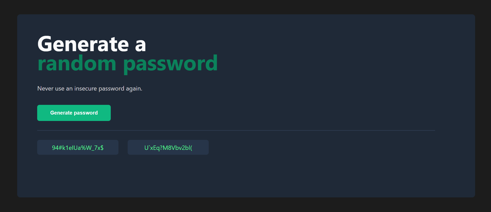

Password Generator

A simple random password generator built with HTML, CSS, and JavaScript.
Click the Generate password button to generate two secure random passwords which appear in the two output boxes.

🔥 Live Preview

Open index.html in your browser (or serve the folder with Live Server / GitHub Pages) to run the project locally.

🧩 Features

Generates two random passwords at once.

Uses uppercase, lowercase, numbers and symbols.

Minimal, dark-themed UI.

Copy-ready output containers (easy to extend to add copy-to-clipboard).

🛠 Tech Stack

HTML

CSS

JavaScript (vanilla)

📂 Project Structure
.
├── index.html        # markup + button that calls generate()
├── index.css         # styles for layout and components
└── index.js          # password generation logic

📋 How it works (short)

index.html contains the layout:

#btn — button with onclick="generate()".

#rectangle1 and #rectangle2 — where generated passwords are shown.

index.js:

characters array contains all allowed characters.

generate() builds two 15-character passwords using:

js:-
characters[Math.floor(Math.random() * characters.length)]

Results are placed into the DOM using:
js:-
p1El.textContent = p1
p2El.textContent = p2

## 🚀 **Live Site**
### 👉 [**Open Password Generator**](https://password-generator-shubhu.netlify.app/)

🖼 Screenshot

